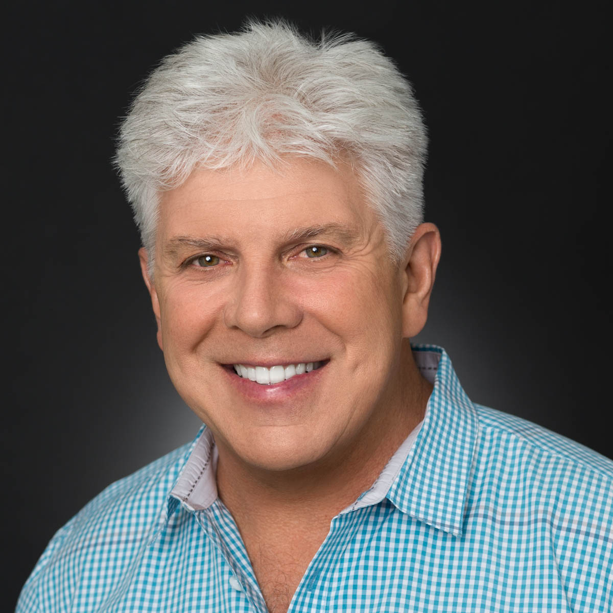

# Jeffrey W. Small

**VP Engineering & CTO | AI Systems | Product Engineering | San Francisco**

---

## Who I Am

I'm a software engineer who became an engineering leader, and I've never really stopped being both.

I've been building software since 1985, starting as the sole developer on a 2D CAD product at Autodesk, growing that into a 17-person team, and eventually leading engineering organizations of 100+ people at companies like Autodesk and Blackboard. Along the way I've shipped products that generated $60M in year one, scaled platforms that are now doing $2.94B in annual revenue, and most recently spent seven years building production AI systems before most companies knew they needed them.

I'm based in San Francisco and I'm currently looking for my next VP Engineering or CTO role, ideally somewhere building something hard with AI at the core.

If you're here because you're evaluating me for a role, I hope this gives you a better sense of who I am than a resume can. If you're here because you want to collaborate, build something, or just talk about where AI is going, I'm genuinely interested in that conversation too.

---

## How I Lead

My management philosophy has an origin story.

I spent the early part of my career at Autodesk in the 1980s and 90s. The founders were brilliant, genuinely and obviously brilliant, and I learned an enormous amount just by being in the building. But as a young engineer I found them, and most of the managers around me, difficult to access. Not unfriendly, just not particularly invested in helping junior people figure things out. You were expected to sink or swim, and a lot of people sank.

I swam, but I noticed what it felt like to not have support. I noticed the questions I was afraid to ask, the architectural decisions I made in isolation that probably would have been better with fifteen minutes of guidance from someone more experienced, the times I went down the wrong path for weeks because nobody pointed me in a better direction early enough.

So when I became a manager I made a pretty simple decision: I was going to be the manager I never had.

That meant being genuinely accessible. It meant spending real time with my direct reports, not just status updates but working through problems together, whiteboarding architecture, talking through career decisions. It meant being the kind of leader where people could walk up and say "I don't know how to approach this" without feeling like they were admitting failure.

It also meant high standards. Being approachable doesn't mean being easy. I've always believed that the best thing you can do for an engineer is help them do work they're genuinely proud of, which sometimes means pushing back, raising the bar, and having honest conversations about what good actually looks like.

Over 35+ years that philosophy has held up. The details have evolved. I lead differently at a 5-person startup than at a 100-person org, and AI has changed what's possible in ways I'm still exploring. But the core is the same. Be accessible. Work through problems together. Hold a high bar. Be the manager you wish you'd had.

---

## Career

### General Manager & Chief Engineer, AutoSketch — Autodesk
**February 1985 – February 1994**

I started my career at Autodesk and I couldn't have chosen a better place to land. Thirteen seasoned founders, most of them programmers who had been there for the birth of the PC and the DOS operating system, all passionate about building useful software for the world. One of my first assignments was developing an architectural package written in LISP as the first in-house third party application built on top of AutoCAD.

During one monthly engineering meeting, the main founder John Walker announced that the board had turned down his proposal to replace AutoCAD with a novel, object-based alternative he had developed with another founder who had been a primary designer of the Apple Lisa. He called it AutoSketch. As a newly public company, the Autodesk board wasn't interested in anything that might disrupt the meteoric trajectory of AutoCAD sales, so John was looking for volunteers to take it over and make something of it.

My hand shot up.

I grew AutoSketch into a team of 12 engineers, 2 Tech Pubs, 1 Product Manager, and 2 QA people, not counting the 13 language teams supporting it internationally. Where AutoCAD was complex and difficult to learn, AutoSketch was accessible to professionals and laypeople alike. We sold it at the low end of the market and it became, at the time, Autodesk's second highest revenue product, growing from roughly $100,000 a year in 1987 to $12 million by 1994.

It was during this period that I really developed as a manager. I spent significant time helping my team define their work and track progress while also doing my own software development. And I discovered something that took me a while to fully reckon with: it is genuinely hard to take on significant individual contributor work and give full attention to managing people at the same time.

John Walker himself had figured this out. At some point he stepped down as CEO of Autodesk to focus on the AutoCAD codebase, claiming it was in the best interest of the company. That move stayed with me for a long time. Object Oriented Programming was being commercialized, the Web and Mobile were on the horizon, and there was still a lot I wanted to learn. So I made the difficult decision to step down from management. I offered my Tech Pubs manager my role because she modeled all of the traits I believed a manager should have. I knew I would come back to management eventually. In the meantime I wanted to immerse myself in what was coming next.

---

### Chief Engineer, AutoCAD LT — Autodesk
**February 1994 – December 1997**

In the early 1990s, ex-Sun Microsystems executive Carol Bartz was brought in as Autodesk's new CEO. Carol had the business savvy the company had been lacking and one of the gaps she identified quickly was a CAD product that sat between AutoCAD at the high end and AutoSketch at the low end. It needed to share drawing files with AutoCAD but feel more approachable than AutoCAD did.

Her bet was straightforward: take my AutoSketch team, have us create a focused subset of AutoCAD, add functionality to bridge the usability gaps, and Autodesk would have a winner. It was hard to leave the product we had spent years building but Carol was completely right, and we threw ourselves into it.

One of the best decisions I made during this period was hiring Autodesk's first Usability Engineer and establishing a Usability Lab so we could test real customer reactions to features as we developed them rather than after we shipped. That discipline shaped everything we built. The result was a product that felt genuinely different from AutoCAD even though it was technically a subset, because the usability improvements ran so deep.

AutoCAD LT grossed $72 million in revenue in its first year and kept growing from there. It remains one of the more satisfying things I have been part of building.

---

### Senior Software Engineer, AutoCAD — Autodesk
**December 1997 – March 1999**

Many of the usability features we developed for AutoSketch and AutoCAD LT eventually made their way into AutoCAD itself. Most of that happened through existing APIs, which was fine. But there was one feature I had developed for AutoSketch that I had always wanted to bring to AutoCAD and could only do as part of an official release because of how architecturally invasive it was.

In AutoCAD, printing and plotting was notoriously complex. Users spent enormous amounts of time and frustration trying to get their designs onto paper correctly. I had already rewritten the printing capability for AutoSketch to be fully interactive so users could see exactly how their output would look before committing to it. Now I wanted to do the same for AutoCAD, but bigger.

What I built was a system that let users interactively set up multiple output configurations in a single drawing session, routing different sheets to different devices like printers and plotters simultaneously. We called these configurations Layouts. The feature was deemed novel enough to earn a patent: Multiple Output Device Association, US 7,366,980, issued April 29, 2008.

It was a good way to close out my time at Autodesk.

---

### Senior Software Architect, NearSpace
**June 1999 – March 2002**

After fourteen years at Autodesk I was ready for something new. Desktop software had been my world and I wanted to get my hands into what was coming next: mobile and SaaS. When I heard that one of the Autodesk founders and a couple of senior engineering executives had started a company called NearSpace, I was interested immediately.

The idea was ahead of its time. NearSpace built wayfinding services for built environments, delivering maps and location-aware information about tradeshows, university campuses, hotels, and similar spaces to handheld devices. Users could find out what was happening in a space, get information about it, and navigate to where they wanted to go. We built an environment authoring tool and a device-independent client that ran on Palm OS and Pocket PC, which were the platforms of the moment.

Once the initial product was working and gaining traction, I put on a suit and went out into the San Francisco Financial District to try to sell it to hotels and building management companies. That experience taught me a lot about what it actually takes to get someone to buy something, and how different that is from building it.

Unfortunately we were operating right in the middle of the dot-bomb period. Companies were scrutinizing every investment for clear ROI and NearSpace was considered more of a nice-to-have. I worked the first year for equity and then on a reduced salary. Eventually it became clear that I needed to find something that could support my family, and I moved on. But I have always had a soft spot for NearSpace. The problem they were solving was real and the team was sharp. The timing just wasn't right.

---

### Director of Software Engineering, ProcurePoint
**March 2002 – March 2004**

ProcurePoint was a Sequoia Capital backed company specializing in hotel procurement, including reverse auction technology that let buyers drive down supplier pricing in real time. When I arrived in March 2002 they had already spent significant investment on a platform that needed to be rewritten. It was underperforming and they were also paying a sizable annual premium for third party auction technology that was eating into the business.

I was asked to fix both problems.

In my first year I led a full rewrite of the SaaS application using design patterns that made it significantly more performant and extensible, and I designed and built our own auction engine to replace the expensive third party technology. The new engine was more flexible and better suited to what the company actually needed than what they had been paying for.

ProcurePoint was eventually acquired by Sabre Corporation, the global travel industry platform. It was a good outcome for the company and a good chapter for me. I came in with two clear problems to solve, solved them, and the business was stronger for it.

---

### Senior Software Architect, Kivera
**March 2004 – April 2005**

By 2004 phones were becoming genuinely capable and location based services were starting to feel like a real market. I joined Kivera as Senior Architect to help build exactly that: location aware services for the web and handheld devices.

One of my first assignments was leading my team to build a real-time traffic application for J2ME devices, incorporating Assisted GPS to improve location tracking on phones. Within six months we had a fully working mobile and web application. That led directly to winning Sprint and AT&T contracts, beating out a field of competitors that included Autodesk, who showed up to the evaluation with PowerPoint slides while we had working software. That contrast stuck with me and I have thought about it many times since when deciding how to approach a competitive situation.

I also led the architecture and development of a fleet tracking application that used the latest in location services to let dispatchers see where their vehicles were in real time, something that sounds obvious now but was genuinely novel at the time.

Kivera was acquired by TeleCommunication Systems for our technology, which they wanted for E9-1-1 emergency location services and tactical satellite communications for the government. The acquisition shifted the product direction significantly and combined with a lengthy commute it felt like the right moment to find the next thing.

---

### Senior Director of Technology, PDI Ninth House
**May 2005 – June 2010**

This is the point in my career where I stepped back into full time management and I have never looked back.

PDI Ninth House was producing something genuinely creative: leadership and management training content based on bestselling business books like Ken Blanchard's Situational Leadership, The One Minute Manager, and Building Trust, brought to life as high production cinematic branching video courses featuring SAG actors. The idea was to use the storytelling power of film to convey leadership concepts in a way that felt real rather than instructional. I found that compelling then and I still do.

The team I inherited had largely been part of a successful rock band called Engine 88. Creative, talented people who knew how to collaborate and perform under pressure. My job was to bring the engineering discipline that matched their creative ambition, which meant modernizing source control and CI/CD practices, introducing unit testing, adopting Agile development methodology, and adding localization capability.

I also grew the team significantly, staffing up by 300% to meet company product launch dates for new business objectives that included creating custom content for the FBI, Navy, Air Force, Citigroup, and Goldman Sachs covering topics like sexual harassment prevention, sensitivity training, and shared leadership responsibilities.

Five years here deepened my conviction that the best engineering organizations are ones where the people doing the work feel genuine ownership over what they are building. The PDI Ninth House team cared about what they were making in a way that was infectious. My job was to give them the structure and practices to build it well.

---

### Director of Engineering, BIM 360 — Autodesk
**July 2010 – April 2015**

This role marked my return to Autodesk after more than ten years away and it turned out to be one of the most formative chapters of my career.

The hire itself was a sensitive one. The team of about twelve engineers had already been through a couple of failed attempts at finding a leader. Previous hires had either taken other roles inside Autodesk or left for outside opportunities early, and the team was understandably skittish. What I think resonated with them in those first conversations was the story I told about wanting to be the manager I never had. I wasn't coming in with a transformation playbook. I was coming in as someone who genuinely wanted to be present and available and to work through problems alongside them.

I started on the Autodesk Buzzsaw product, a SaaS based document management application for the construction and building industry and the only SaaS product Autodesk had at the time. Within my first few months I identified surplus budget, brought in a contracting firm, and delivered Autodesk's first iOS mobile application for Buzzsaw within a single quarter. That got noticed and led to a promotion after five months.

From there I was given the Green Building Studio team, which was building technology to optimize energy efficiency and carbon footprint in building designs. Then came the acquisition that changed everything.

Autodesk acquired Horizontal Systems, whose product Horizontal Glue specialized in bringing BIM to the cloud. It let multidisciplinary teams collaborate on 3D models in real time across more than 40 different file formats, so architects and engineers using completely different software could work together without compatibility issues. Users could perform clash detection, scheduling, and estimates directly within a web hosted model. It was a significant step in Autodesk's move toward cloud based project management and it eventually became the foundation of Autodesk BIM 360.

A number of other acquisitions and products were added to the BIM 360 mix during my tenure, which created a real coordination challenge: how do you align all of these efforts toward common business objectives while maintaining quality across a growing and increasingly complex organization?

The answer I kept coming back to was culture and practice. From the outset I established what I called a unit testing culture, modeled on what Google had done in the previous decade and what Martin Fowler and others at Thoughtworks had been writing about for years. That meant writing unit tests, TDD, test coverage metrics, continuous integration, continuous builds, automated regression, and pull requests for peer review as standard operating procedure across the organization. I also established Enterprise Caliber goals requiring ongoing improvements in security, scalability, availability, performance, and quality across every product in the portfolio.

Alongside the testing culture I worked across the organization to move teams from older waterfall practices to Agile and Scrum. It was widely embraced and had a real impact on team visibility and the ability to pivot quickly when priorities shifted.

By the end of my tenure I had scaled the BIM 360 engineering organization to over 100 engineers across 20 Scrum teams spanning the US and APAC. The product generated $60 million in revenue in its first year as the fastest growing and most successful product group in Autodesk's 35 year history at that point. It has since evolved into Autodesk Construction Cloud at $2.94 billion in annual revenue.

I left because after four years of that pace I was starting to burn out and was ready for a different kind of challenge. But I am genuinely proud of what that team built and how we built it.

---

### Senior Director of Engineering, Blackboard
**May 2015 – August 2017**

A number of former Autodesk colleagues had moved to Blackboard and reached out to ask if I would be interested in doing there what I had done at BIM 360. They were having serious quality problems and forward development had slowed to a crawl. I knew the challenges would be significant but that kind of situation is honestly where I do some of my best work.

Blackboard had dominated the online education market in the late 1990s and early 2000s but had spent years acquiring disparate systems without a coherent plan for integrating them. In the meantime a new generation of competitors was starting from scratch with no technical debt and modern development practices, and Blackboard was losing ground.

When I arrived the numbers told the story immediately. It took the Learn software development organization an average of two to two and a half months to execute a build. There were no unified development practices, no meaningful CI/CD system in place, no testing culture, very little automation, long lived feature branches creating constant merge conflicts, and substantial technical debt throughout. The team was talented but the environment was working against them at every turn.

I was assigned to the Blackboard Ultra effort, which was meant to be a modernized streamlined interface for the Learn LMS. Clean, responsive, designed for the way people actually used the product. The problem was that Ultra sat on top of a platform that hadn't been properly maintained, and no amount of good front end work was going to fix what was broken underneath. So the scope of my work expanded to include oversight of all the teams that made up both Ultra and the broader Learn platform.

Within my first month I had accomplished the following. I restructured teams into proper Scrum teams following Agile best practices and brought in managers I had previously worked with to help keep things on track. I established a five level testing culture program modeled after the How Google Tests Software framework, with Level One focused on setting up test coverage tooling, continuous builds, test classification, identifying nondeterministic tests, and creating a smoke test suite. I identified Agile champions on each team to reinforce the practices we were putting in place. And I established a GitFlow branching model with two long lived branches and proper supporting branches for feature, release, and hotfix work. By the end of the second month we were running two potentially releasable builds a day.

Over the following two years I grew the organization from two teams to fifteen Scrum teams across the US and APAC, roughly 100 engineers in total. We got the development train moving again, brought a flagship product that had been two years late successfully to market, and established clear goals for reducing technical debt and improving quality, scalability, and performance across the platform.

Blackboard was a harder environment than BIM 360 in some ways because the debt was deeper and the cultural inertia was stronger. But watching a team go from two and a half month build cycles to multiple releasable builds a day in a matter of weeks is one of the more satisfying things I have experienced as an engineering leader.

---

### Chief Technology Officer, Motimatic
**September 2017 – September 2018**

Motimatic had an intriguing business model: combining the latest advances in online advertising technology with motivational science to help individuals achieve their goals. The primary market was online universities, delivering targeted ad content based on behavioral science concepts to motivate students to complete their degrees. The technology was genuinely interesting. The execution needed work.

I was brought in to fix the engineering organization and deliver what the founder needed. That meant relocating from San Francisco to San Luis Obispo for ten months to sit directly with the team, which I did. Being physically present with a team that needs to change is different from trying to drive change remotely and I wanted to do it right.

During that period we overhauled the platform, fixed the deficiencies that were preventing reliable data analysis, eliminated the bad data that was blocking informed decision making, and introduced proper Agile practices including Scrum, acceptance criteria, definitions of done and ready, story mapping, and effort impact prioritization. We also got the company fully GDPR compliant, which was becoming a critical requirement at the time.

By the time I left the team was delivering reliably and the founder had everything he had asked for. It was a good year of focused work and a reminder that sometimes the most valuable thing you can do as a technical leader is show up, do the unglamorous work of fixing the foundation, and leave the team in a better state than you found it.

---

### VP of Engineering, Talkmap
**September 2018 – February 2026**

Talkmap's goal was to use AI to find actionable insights in the conversations companies have with their customers, helping those companies improve both their people and their business. When I joined in 2018 I had only minimal exposure to AI, but I convinced the founder I was a quick learner and that what I did bring was years of experience helping companies build hardened and effective engineering teams and practices. That turned out to be exactly what was needed.

The company had started seven months earlier with a founder, a CEO, a CTO, and a small development team. But the founder and investors were not happy with the progress or direction and decided a change needed to happen. I was hired to bring what the organization was missing.

One of my first tasks was to review everything that had been built and decide what to keep. After a thorough review I concluded that most of the code was low quality, poorly architected, and not something we wanted to carry forward as enterprise grade IP. The only piece worth retaining was a module one developer had built for conversation intent analysis. My recommendation was to keep that developer and start over. In September 2018 the Talkmap team consisted of the founder, one developer, and me.

From that point I applied everything I had accumulated over the years. I used Roman Pichler's Product Canvas approach to define the product with the founder: name, goal, target group, big picture, product details, and metrics. I used Jeff Patton's Story Mapping technique to build a shared understanding of what the initial product should look like, focused on user value. I hired the best people I could find, mostly from my network. I established Agile best practices and a testing culture from day one.

We started with a monolith but quickly determined that what we were building was better suited to a microservices architecture where services could be scaled and deployed independently. We adopted a one week sprint hybrid Scrumban framework to allow the team to pivot to customer work or other priorities as they emerged. One week sprints have been my preference throughout my career for a simple reason: people naturally procrastinate when they have more time, and anything longer than a week makes pivoting genuinely painful. When you are two days into a two week sprint and something urgent comes up, dropping everything feels costly. When you are two days into a one week sprint you can usually justify finishing the week and pivoting cleanly on Monday. The cadence keeps the team honest and keeps options open.

And we pivoted frequently. During one early customer proof of concept we realized Apache Nifi was a bottleneck for conversation data ingestion, so we immediately prioritized replacing it with Apache Kafka. There were many such moments over the years: replacing StarDog GraphDB with PostgreSQL, rewriting Python modules in Go, adding ClickHouse for fast aggregations. Having a development practice that could support rapid pivots was not optional, it was how we survived.

Our first official proof of concept with a major payment corporation in early 2019 is a good illustration of where we started and how far we came. At the time, ingesting a batch of 100,000 conversations took a couple of days to process and tagging all conversations with the required metadata was a significant undertaking. Setting up a dedicated client environment for the customer took our two person DevOps team a week or more. Despite all of that, in less than a week we discovered more conversation intents than this large payment corporation had found in six months with a team of twenty. With the platform we built over the following years, that same job would take an hour to process and five minutes to deploy.

Over seven years we built Talkdiscovery into a production enterprise platform that processed millions of conversations for clients in telecom and financial services including AT&T, running on a 15 microservice architecture on AWS with 99.9% SLA and SOC 2 Type II compliance. I drove much of the product design myself, prototyping in Snagit and authoring all feature specifications, and I was deeply involved in the architecture and delivery of every major system component: the multi-stage AI pipeline combining classical ML with LLM based reasoning, the multi-agent orchestration layer, the evaluation framework, and the observability infrastructure.

One of the things I am most proud of from this period happened in early 2025 when the company was navigating a difficult pivot from enterprise to SMB. Investors wanted to know what would be different. I proposed building connectors to every major CCaaS platform on the market to get conversations into Talkmap faster and remove the friction that had been slowing enterprise deals. Then I went and built it myself, a full suite of CCaaS integrations, in a nine day solo sprint using Claude Code. It worked, it shipped, and it gave the company and the team a real shot of momentum at a moment when they needed it.

Talkmap wound down in early 2026. I'm proud of what we built and how we built it, and I'm looking for what comes next.

---

## What I'm Working On

I'm currently looking for my next VP Engineering or CTO role, ideally somewhere building something meaningful with AI at the core. If you're evaluating me for a position, my resume is here and I'm happy to talk.

Outside of the job search I've been building eHouseManual, a home maintenance management platform I started as an AI vibe coding experiment using Claude. I built a complete working prototype in a single weekend while doing chores around the house, which felt like a reasonable proof of concept for the idea. I've been continuing to develop it since then partly because the problem is genuinely useful and partly because building with AI tools every day is the best way I know to stay current on where things are going.

The eHouseManual project has been a good reminder of something I have believed for a while: the gap between what one person can build alone and what a small team can build has compressed dramatically. The leverage available to someone who knows how to work with AI tools effectively is unlike anything I have seen in 35 years of building software. I find that genuinely exciting rather than threatening, which probably says something about how I think about technology in general.

I'm also open to advisory conversations, collaborations, or just interesting discussions about where AI and engineering leadership are headed. If something here resonated with you, reach out.

---

## Let's Talk

I'm not hard to find.

The best way to reach me is email at jsmall1234@gmail.com. I'm also on LinkedIn at [linkedin.com/in/jeffreysmall](https://linkedin.com/in/jeffreysmall) and GitHub at [github.com/jsmall1234](https://github.com/jsmall1234).

If you want to see something I've actually built, eHouseManual is live at [ehousemanual.com](https://ehousemanual.com).

I'm based in San Francisco and generally available for conversations during Pacific Time business hours, though I'm flexible.
